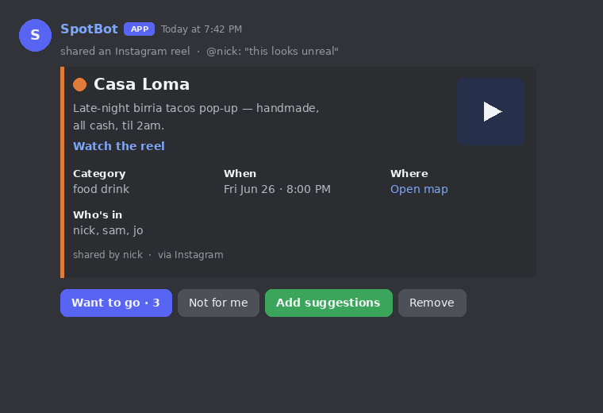
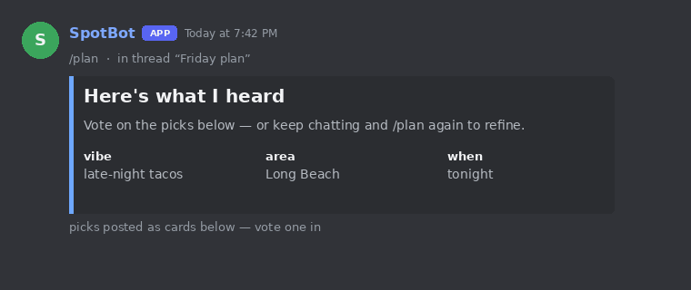
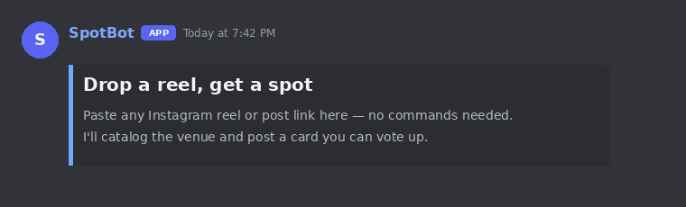

# SpotBot

**Turn the Instagram reels your friends already share into places you actually go.**

[](https://github.com/NickNojiri/SocialAgent-Team10/actions/workflows/ci.yml)
&nbsp;·&nbsp; Local-first (Ollama + OpenStreetMap) &nbsp;·&nbsp; 143 offline tests passing

Your group chat is full of "we should go here!" reels that nobody ever acts on.
SpotBot reads those reels — **caption *and* spoken audio** — figures out the venue,
time, and location with a local LLM, and turns each one into a **votable card** in
Discord. When you're ready to actually go out, `/plan` reads the recent chat and
puts together an outing the group can vote on.

No spreadsheets. No copy-paste. Paste a link, get a plan.



---

## Highlights

- 🎬 **Paste-and-go capture** — drop an Instagram reel/post link in a DM, an
  `@mention`, or a designated drop channel. No command required.
- 🗣️ **Hears what the caption doesn't say** — reels often *say* the venue out loud.
  SpotBot transcribes the audio locally (Whisper) and feeds it to the LLM alongside
  the caption, so a spot mentioned only in speech still gets captured.
- 🗳️ **One shared catalog** — every spot is a card with persistent vote buttons.
  Votes from Discord and the web admin land in the same store and survive restarts.
- 🧭 **Group planning** — `/plan` infers the vibe / area / time from recent chat and
  opens a thread with picks to vote on.
- 🔒 **Local-first & private** — the LLM (Ollama) and geocoding (OpenStreetMap) run
  locally or on free open APIs. Post text never leaves your machine.
- 🌐 **Web admin + API** — a FastAPI catalog UI and a recommend/plan service share the
  same data, so the bot and the browser are always in sync.

---

## What it looks like

**Capture → card.** Paste a reel; SpotBot replies with a spot card. 👍 *Want to go*,
👎 *Not for me*, ✨ *Add suggestions* (posts similar spots as their own votable cards),
or *Remove* it.


**Plan the outing — `/plan`.** It reflects back what it heard, then drops picks to vote on.



**First-time nudge.** A DM with no link gets a friendly onboarding card.



> These are mockups rendered straight from the bot's embed/button code
> (`app/cards.py`, `app/bot.py`) via `python scripts/gen_ui_mockups.py`.

---

## How it works

```
Instagram reel ──► Discord (DM / @mention / drop channel)
                        │
                        ▼
                 ┌──────────────┐   Playwright fetch → caption + mp4
                 │  Ingestion   │   Whisper → spoken transcript
                 │   pipeline   │   Local LLM (Ollama) → venue · category
                 │              │   OpenStreetMap → coordinates
                 │              │   Time parser → schedule
                 └──────┬───────┘
                        ▼
                 ChromaDB catalog  ◄──►  Web admin (:8010)
                        │
                        ▼
        Spot card with vote buttons  +  /events · /plan recommendations
```

The capture pipeline degrades gracefully at every stage: no audio → caption only;
no LLM → keyword heuristics; no geocoder → "location unresolved". A reel never
hard-fails a run. Full architecture: **[docs/PIPELINE.md](docs/PIPELINE.md)**.

---

## Quick start

### Prerequisites

- **Python 3.12**
- **[Ollama](https://ollama.com/download)** running locally, with a model pulled
  (`ollama pull llama3.1:8b`)
- A **Discord bot token** with the *Message Content* intent enabled
  ([Discord Developer Portal](https://discord.com/developers/applications))
- **Docker** (for the containerized path) — or just Python for the local path
- *Optional, for reel-audio transcription:* `ffmpeg` + `pip install faster-whisper`

### 1. Configure

```bash
cp .env.example .env
# then edit .env and set DISCORD_TOKEN=...
```

### 2a. Run with Docker (recommended)

```bash
docker compose up --build
```

This starts the bot, the LLM service, the database, and the recommend service.
Ollama runs on the host and is reached via `host.docker.internal`.

### 2b. Run locally (Windows-friendly)

```powershell
.\scripts\setup.ps1        # one-time: venv + dependencies
.\scripts\run_local.ps1    # starts admin (:8010) + recommend (:8003) + the bot
```

On networks that intercept TLS (campus / corporate) and break the bot's
connection to Discord, add `-InsecureSsl` (or set `BOT_INSECURE_SSL=1`).

### 3. Invite the bot and try it

Invite the bot to your server, then **paste an Instagram reel link in a DM** — or run
`/dropchannel` in a channel and paste links there. You'll get a spot card back.

---

## Using the bot

**The main loop needs no commands:** paste a reel in a DM, an `@mention`, or a
`/dropchannel`-enabled channel, and SpotBot captures it and posts a card.

Slash commands fill in the rest:

| Command | What it does |
|---|---|
| `/plan` | Read the recent chat and plan an outing together (opens a thread with picks). |
| `/events <vibe>` | Find spots matching a vibe, e.g. `/events late night tacos`. |
| `/catalog` | Show the top-voted spots in the catalog. |
| `/dropchannel` | Toggle a channel as a reel drop zone (auto-captures any IG link). |
| `/suggestions` | Toggle automatic spot suggestions in the current channel. |
| `/here` · `/leave` · `/channels` | Enable / disable / list conversational channels. |
| `/help` | How to save spots with the bot. |

On a spot card: **Want to go** (👍) and **Not for me** (👎) vote · **Add suggestions**
(✨) posts similar spots as their own votable cards · **Remove** deletes it (requires
*Manage Messages* in a server).

---

## Configuration

All settings come from `.env` (see `.env.example`):

| Variable | Default | Purpose |
|---|---|---|
| `DISCORD_TOKEN` | — | **Required.** Your Discord bot token. |
| `OLLAMA_URL` | `http://host.docker.internal:11434` | Where Ollama is reachable. |
| `OLLAMA_MODEL` | `llama3.2` | Local model for extraction. |
| `BOT_CHANNEL_ID` | `0` | Limit the bot to one channel, or `0` for anywhere. |
| `LLM_URL` / `DB_URL` / `RECOMMEND_URL` | internal `:8001` / `:8002` / `:8003` | Service URLs. |
| `INGEST_URL` / `ADMIN_URL` | `http://host.docker.internal:8010` | Catalog/admin app. |
| `CHROMA_PATH` | `data` | Path to the Chroma vector store. |
| `BOT_INSECURE_SSL` | unset | Set to `1` to skip TLS verification on intercepting proxies. |

Services and ports: **bot** (Discord) · **llm** `:8001` · **db** `:8002` ·
**recommend** `:8003` · **admin** `:8010`.

---

## Testing

```bash
pip install -r requirements.txt
pytest -k "not live"          # full offline suite — 143 passing
```

`live`-marked tests need real network access plus Ollama and are skipped offline.
CI runs the offline ingestion suite on every push. To validate the live
reel transcribe + summarize path end-to-end, follow
**[docs/REEL_TRANSCRIBE_TEST_PLAN.md](docs/REEL_TRANSCRIBE_TEST_PLAN.md)**.

---

## Privacy & guardrails

- **Local LLM** — captions and transcripts are processed by Ollama on your machine;
  nothing is sent to a third-party model API.
- **Public content only** — SpotBot fetches the URLs you give it, one at a time, with
  per-domain throttling. No login automation, no captcha bypass, no crawling. A
  login-walled URL is reported as such, never circumvented.
- **You own the data** — the catalog is a local ChromaDB store; remove any spot from
  Discord or the web admin at any time.

Intended for small-scale personal and educational use.

---

## Project structure

```
SocialAgent-Team10/
├── app/                # Discord bot
│   ├── bot.py              # paste-and-go capture, /plan, /events, drop channels
│   └── cards.py            # spot embeds + persistent vote / similar / remove buttons
├── src/ingestion/      # Capture → LLM → geo → time → Chroma pipeline
│   ├── pipeline/           # incl. transcriber.py (reel audio → text)
│   ├── browser/            # Playwright session manager + IG embed fallback
│   └── serving/            # admin web UI (:8010) + recommend/plan API (:8003)
├── llm/  ·  db/  ·  recommend/   # containerized services
├── scripts/            # setup.ps1 / run_local.ps1, demos, gen_ui_mockups.py
├── docs/               # PIPELINE.md, RUNBOOK.md, test plans, UI mockups
├── test_*.py           # offline test suite (pytest -k "not live")
└── docker-compose.yml  # bot + llm + db + recommend
```

---

## Roadmap

The full product plan — hosted bot + OSS core, Discord UX phases, capture sources,
web companion, and the growth playbook — lives in
**[docs/PRODUCT_ROADMAP.md](docs/PRODUCT_ROADMAP.md)**. Near-term highlights:

- **Capture reliability → 95–99%** via authenticated IG ingestion — see
  [docs/IG_AUTH_INGESTION_PLAN.md](docs/IG_AUTH_INGESTION_PLAN.md).
- **Spot card v2** — reel thumbnails and map links on cards.
- **`/plan` v2** — vote quorum → auto-created Discord Scheduled Event.
- **Shareable web catalog** — a public map/list page per server.

---

## Tech stack

Discord.py · Playwright · Ollama (local LLM) · faster-whisper (speech-to-text) ·
OpenStreetMap (Nominatim/Overpass) · ChromaDB · FastAPI · Docker.
