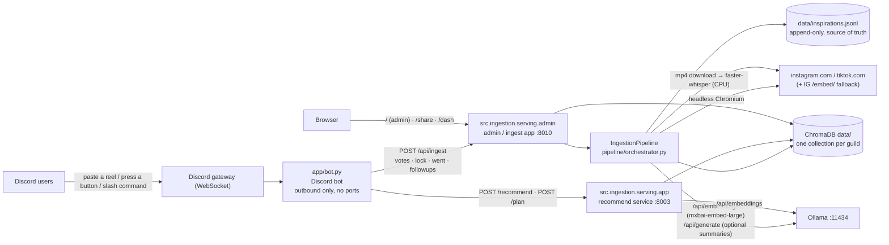
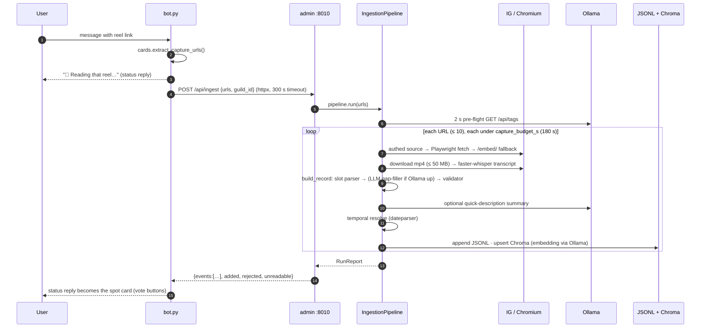
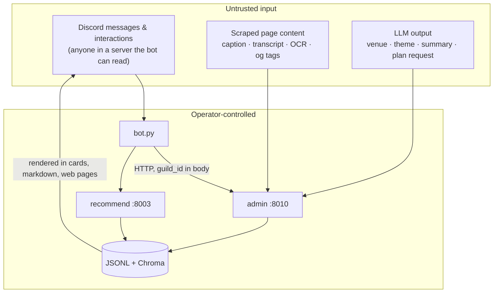

# SpotBot — Architecture

Written 2026-09-15 (Sprint 1 deliverable). Owner: Nick. This is the current-state
topology; decisions behind it live in [`docs/adr/`](adr/README.md). Where an older
doc disagrees with this one (see [§8](#8-older-docs-and-what-they-still-cover)),
this one is right.

Everything runs on one machine with no paid services: local Ollama for embeddings,
OpenStreetMap for geocoding, ChromaDB on disk. Post text never leaves that machine.

---

## 1. Processes and ports



| Process | Entry point | Where it runs | Talks to |
|---|---|---|---|
| **Discord bot** | `python app/bot.py` (or the `discord-bot` container) | host or Docker | Discord gateway (out), admin `:8010`, recommend `:8003` |
| **Admin / ingest app** | `uvicorn src.ingestion.serving.admin:app --port 8010` | **host only** — it drives Playwright and Whisper | Ollama, Chroma, the internet (reels) |
| **Recommend service** | `uvicorn src.ingestion.serving.app:app --port 8003` (or the `recommend` container) | host or Docker | Ollama, Chroma (read) |
| **Ollama** | installed separately | host | — |

`scripts/run_local.ps1` starts the first three on Windows; `docker compose up` starts
only the bot and recommend containers and expects the admin app on the host
(`INGEST_URL=http://host.docker.internal:8010`).

Every service is one uvicorn worker. That is deliberate at this scale and is the
reason capture concurrency is bounded (see [§4](#4-concurrency-and-time-budgets)).

---

## 2. Data

| Store | Path | What it holds | Notes |
|---|---|---|---|
| **JSONL sink** | `data/inspirations/<guild>.jsonl` (`data/inspirations.jsonl` for the legacy `""` catalog, and for everything captured before 2026-09-24) | every validated `EventInspiration`, appended per capture | the source of truth; Chroma can be rebuilt from it; per server so `/privacy` can delete it (#21) |
| **ChromaDB** | `data/` (`PersistentClient`, SQLite + HNSW) | vectors + metadata per spot: venue, category, theme, votes, voters, schedule, summary, image | one collection per Discord guild — `chroma_sink.collection_for_guild`; `""` is the legacy single-tenant collection `event_inspirations` |
| **Bot config** | `channels.json` | muted channels, suggestion channels, tipped guilds | written by the bot, not the admin app |
| **Server settings** | `data/guild_settings/<guild>.json` | `/setup`'s reels channel (`drop_channel_id`, null = every channel) and `home_city` | one file per server, via `GET/PUT /api/settings` (tenant token, full scope); must move with `data/` to staging; #21 deletes it |
| **Feedback + survey** | `data/feedback/<guild>.jsonl` | `/feedback` reports and `/survey` SUS answers (+ participant code, score) | no user id or name stored; `GET /api/survey` gives count / mean / SD; #21 deletes it |
| **Deletion leftovers** | `data/.spotbot_forget_pending.json` | vector-index folders a `/privacy` delete couldn't remove while open, and whether a VACUUM is owed | finished and removed by the admin app's next start (`serving/forget.py::finish_pending`) |
| **Failed-fetch HTML** | `data/raw/<guild>/snapshot-*.html` (older ones directly in `data/raw/`) | page HTML of rejected / unreadable fetches | debugging only; deleted with the server (#21); no time-based retention yet |
| **IG session** | `data/ig_session.json` | burner-account cookie for the authed fetch path | gitignored; optional |
| **Label corpus** | `fixtures/labels.jsonl` | 433 labeled reels — the accuracy benchmark | committed; scored by `src/ingestion/eval.py` |

The vectors are bound to the embedding model: the whole store must be written and
queried with the same one (`config.embed_model`, currently `mxbai-embed-large`,
1024-dim). Changing the model means re-embedding from the JSONL. See ADR-0001.

---

## 3. One capture, end to end



Stage → module map:

| Stage | Module | Optional? | Degrades to |
|---|---|---|---|
| Fetch (authed) | `sources/ig_authed.py` (instagrapi) | yes (`IG_USERNAME`) | Playwright |
| Fetch (browser) | `browser/session_manager.py` (Playwright) | required | login wall → `/embed/` fallback (`browser/ig_embed.py`) |
| Extract page → `RawPostSnapshot` | `extractors/instagram.py`, `tiktok.py`, `generic.py` | required | — |
| Transcribe | `pipeline/transcriber.py` (faster-whisper) | yes (`TRANSCRIBE_ENABLED`) | no transcript |
| OCR cover image | `pipeline/ocr.py` (rapidocr) | yes (`OCR_ENABLED`) | no on-screen text |
| Venue / category / city | `pipeline/normalizer.py` (slot parser + alias table + gazetteer) | required | — |
| LLM gap-filler | `pipeline/llm_extractor.py` | yes (Ollama up) | heuristics only — see ADR-0002 |
| Validate | `pipeline/validator.py` → `schemas/inspiration.py` (strict) | required | reject with a reason |
| Summary | `pipeline/summarizer.py` | yes | card shows "No info" |
| Geocode | `pipeline/geo_enricher.py` (Nominatim) | **off in the admin path** | coords from the IG location tag only |
| Schedule | `pipeline/temporal_resolver.py` | yes | `unscheduled` |
| Store | `sinks/jsonl_sink.py`, `sinks/chroma_sink.py` | Chroma best-effort | JSONL always written |

Internals of each stage: [`docs/PIPELINE.md`](PIPELINE.md) §2–3 (still accurate).

---

## 4. Concurrency and time budgets

- The default bot path is asynchronous: it enqueues through `POST /api/jobs` and polls
  `GET /api/jobs/{id}`. Timeouts and 5xx responses do not abandon the capture until the
  outage has lasted 60 consecutive seconds (`INGEST_POLL_ERROR_S`); a successful poll
  resets that window. After the window, the bot warns that the server-side job may
  still be running. A 404 says the catalog restarted and lost the capture; operator
  logs explain that `JOB_STORE=sqlite` preserves jobs across restarts.
  The admin app has one in-process worker by default
  (`INGEST_WORKERS=1`) and accepts at most 50 waiting jobs; a full queue returns 429.
  Finished jobs remain pollable for one hour. Whisper is CPU-bound, so increasing the
  worker count makes captures contend for cores.
- `INGEST_ASYNC=0` restores the synchronous `POST /api/ingest` path, which waits for
  every URL with a **300 s** bot timeout. Playwright runs on the event loop and
  post-fetch work runs in `asyncio.to_thread`, under `capture_budget_s` (default
  **180 s per URL**). A multi-link request can outlive the bot timeout while the server
  keeps working. This fallback has **no in-flight deduplication**, so Retry can start
  the same capture again.
- A job whose stage is `retrying` is sleeping between transient attempts: 5 s, 10 s,
  then exponentially up to 60 s. For per-link results, only a page-load `TIMEOUT` or an
  exact allow-listed Chromium network code is retried. The code must be either bare or
  parsed from Playwright's `Page.goto: net::ERR_* at …` shape; an allow-listed word in
  the URL does not count. The allow-list is `net::ERR_CONNECTION_RESET`,
  `net::ERR_CONNECTION_CLOSED`, `net::ERR_CONNECTION_REFUSED`,
  `net::ERR_CONNECTION_TIMED_OUT`, `net::ERR_TIMED_OUT`, `net::ERR_EMPTY_RESPONSE`,
  `net::ERR_NETWORK_CHANGED`, `net::ERR_INTERNET_DISCONNECTED`,
  `net::ERR_NAME_NOT_RESOLVED`, `net::ERR_ADDRESS_UNREACHABLE`, and
  `net::ERR_HTTP2_PROTOCOL_ERROR`. A whole run is retried only when
  `is_transient_error` sees `TimeoutError`, `ConnectionError`, or
  `httpx.TransportError`. Login walls, 404s, certificate/SSL errors, rejected
  extraction, and unexpected bugs are final.
- The in-memory store remains the default. `JOB_STORE=sqlite` persists state and
  recovers a queued or running job once after restart; a second interruption fails it
  with a reason. See [ADR-0005](adr/0005-sqlite-job-store.md), which supersedes
  ADR-0004's volatile-store decision without changing the queue or polling contracts.
- Capture admission is enforced in the admin service, before sync work starts or an
  async job enters the queue. It has rolling per-user, per-server, and per-server daily
  counters. The counters are in memory and reset with the single admin process. A
  refusal returns 429 with `Retry-After` and logs one
  `[capture_rate_limit] refused guild=… user=… limit=…` line; tokens are never logged.
  A limit counts **accepted pastes**, not links: one request of up to 10 links is one.
  A duplicate paste or Retry that joins an in-flight job is free. Count defaults
  remain disabled (`0`) until Nick approves feature #28's values.
- Queue depth and the bot's patience must agree. The bot waits up to `INGEST_WAIT_S`
  (900 s) for a job; the queue holds up to `INGEST_MAX_QUEUED` (50) waiting. At ~60 s a
  capture on one worker, anything past ~15 deep is reported "did not finish" while still
  queued, and completes unseen. `scripts/load_test_jobs.py` measures this; choosing the
  number is Nick's call.
- Ollama gets one 2 s pre-flight per run; if it is down the run is
  heuristics-only with no summaries, instantly.
- Per-domain throttling in the session manager; ≤ 10 URLs per request; 50 MB
  cap on any video download.

Job-queue switches (unset values use these code defaults):

| Variable | Process | Default | Effect |
|---|---|---|---|
| `INGEST_ASYNC` | bot | enabled | Enqueues and polls capture jobs; set to `0` to use synchronous `/api/ingest`. |
| `INGEST_POLL_ERROR_S` | bot | `60` seconds | Keeps polling through a continuous timeout/5xx outage for this long; a successful poll resets the window. |
| `JOB_STORE` | admin | in-memory | Set to `sqlite` to persist jobs and enable restart recovery. |
| `JOB_DB` | admin | `data/jobs.db` | SQLite file used only when `JOB_STORE=sqlite`. |
| `INGEST_MAX_RETRIES` | admin | `2` | Maximum retries after the first pipeline attempt. `0` disables retries; a retryable link result records `could not load N link(s); retries disabled`. |
| `INGEST_MAX_QUEUED` | admin | `50` | Waiting jobs before `POST /api/jobs` returns 429 (queue full, no `Retry-After`). |
| `CAPTURE_USER_LIMIT` / `CAPTURE_USER_WINDOW_S` | admin | `0` / `600` seconds | Per-user accepted capture requests in the rolling window; `0` disables it. |
| `CAPTURE_SERVER_LIMIT` / `CAPTURE_SERVER_WINDOW_S` | admin | `0` / `3600` seconds | Per-server accepted capture requests in the rolling window; `0` disables it. |
| `CAPTURE_DAILY_LIMIT` / `CAPTURE_DAILY_WINDOW_S` | admin | `0` / `86400` seconds | Per-server accepted capture requests in the rolling daily window; `0` disables it. |
| `INGEST_SLOW_AFTER_S` | bot | `180` seconds | Adds a “still working” status after this elapsed time; it does not cancel or retry the job. |
| `CAPTURE_LOG` | admin | `data/capture_jobs.jsonl` | Appends one timing/statistics JSON row per finished job; set to `off` to disable it. `/api/stats.capture_health` reports duration percentiles, per-stage p50/p95 with sample counts, duplicate counts, and failed jobs in fixed `restart`/`timeout`/`network`/`internal` buckets. Raw errors, URLs and dedup hashes never leave this cross-server operator view. |
| `TIME_TO_CARD_LOG` | admin | `data/time_to_card.jsonl` | One row per paste as the user saw it (#18): `{ts, seconds, outcome: card\|no_card\|error, links}` — no server, user or link. `/api/stats` → `time_to_card.{last_24h,all}.{pastes,cards,median_s,p95_s}`. `off` disables it. |

---

## 5. HTTP contracts (the seams between tracks)

**Bot → admin `:8010`** (`admin.py`)

| Method | Path | Purpose |
|---|---|---|
| POST | `/api/ingest` | Synchronous `{urls, guild_id, user_id}` with a user-bound tenant token → `{events, added, rejected, unreadable, log, retryable_urls}`; rate-limited, with no in-flight deduplication. |
| POST | `/api/jobs` | Enqueue `{urls, guild_id, user_id}` with a user-bound tenant token → HTTP 202 `{job_id, state, duplicate}`. |
| GET | `/api/jobs/{job_id}` | Poll one job's state, progress, attempts, errors, result, and timing. |
| GET | `/api/jobs?guild_id=&state=failed` | Newest failed jobs for one tenant; optional `limit` defaults to 20 and is clamped to 1–100. |
| GET | `/api/events?guild_id=` | catalog listing for cards, `/catalog`, `/browse`, `/digest` |
| POST | `/api/events/{id}/vote` | `{delta, user_id, user_name}` — identity votes drive quorum |
| POST | `/api/events/{id}/edit` · `/lock` · `/went` | edit modal, Scheduled Event lock-in, went-there confirmations |
| DELETE | `/api/events/{id}` | remove |
| POST | `/api/manual` | manual-add modal |
| GET | `/api/followups?guild_id=&now=` | the hourly went-there loop |
| GET | `/api/stats` · `/api/nights` | dashboard, 100 Nights counter |
| GET | `/` · `/share?guild_id=` · `/dash` | admin page, public read-only catalog, ops dashboard |

### Async capture job calls

Every job call is tenant-authorized. Capture submission includes a `user_id` and uses
`tenant_headers(guild_id, user_id=user_id)`, so changing the claimed user invalidates
the signature instead of selecting a fresh rate-limit counter. A server capture with no
`user_id` is refused (400); only the legacy empty tenant (the local web page) may omit
it. Polling uses `tenant_headers(guild_id)`; the admin service verifies both shapes with
`authorize(...)`.

| Call | Authentication and request | Successful response |
|---|---|---|
| `POST /api/jobs` | User-bound write `X-Tenant-Token` for body `guild_id` + `user_id`; JSON body `{"urls":["https://…"],"guild_id":"123","user_id":"456"}`. | HTTP 202 `{"job_id":"…","state":"queued","duplicate":false}`. `duplicate:true` means the request reused an existing queued/running job and does not consume another rate-limit slot. A full queue or exceeded capture limit returns 429; only limit responses include `Retry-After`, which is how the bot tells them apart. |
| `GET /api/jobs/{job_id}` | Read-capable `X-Tenant-Token` for the job's tenant. The server loads the job first, then calls `authorize(job.guild_id, …, need=SCOPE_READ)`; no caller-supplied `guild_id` is trusted. | The job object below. Unknown, expired, or volatile jobs lost on restart return 404. |
| `GET /api/jobs?guild_id=123&state=failed&limit=20` | Read-capable `X-Tenant-Token` for query `guild_id=123`; checked with `authorize(guild_id, …, need=SCOPE_READ)`. Only `state=failed` is supported. | `{"jobs":[…]}` newest first. Each row has the job object fields plus its tenant's original `urls`. |

`GET /api/jobs/{job_id}` returns this shape (values abbreviated):

```json
{
  "id": "7e91c18bc133",
  "guild_id": "123",
  "state": "queued | running | done | failed",
  "stage": "queued | fetching | transcribing | extracting | saving | retrying | done",
  "progress": {"done": 0, "total": 1},
  "result": null,
  "error": null,
  "created_at": 1790236800.0,
  "updated_at": 1790236800.0,
  "attempts": 0,
  "last_error": null,
  "timing": {"duration_s": 0.125, "stages": {"queued": 0.125}}
}
```

`attempts` counts pipeline runs, including transient retries. `last_error` keeps the
most recent attempt failure, including one that a later retry heals; `error` is
populated when the job itself ends failed. On success, `result` becomes the same
`{events, added, rejected, unreadable, log, retryable_urls}` payload returned by the
capture runner.

**Bot → recommend `:8003`** (`app.py`)

| Method | Path | Purpose |
|---|---|---|
| POST | `/recommend` | `{channel_id, message, mode, guild_id}` → ranked spots + Discord markdown (`/events`, ambient suggestions) |
| POST | `/plan` | `{channel_id, transcript, guild_id, user_id}` → synthesized request + shortlist (`/plan`) |
| GET | `/health` · `/ready` | liveness / store reachable |

`guild_id` selects the Chroma collection on every call, so every call that names one
must carry an **`X-Tenant-Token`** header: an HMAC over the guild (and, for votes and
went-there confirmations, the acting user) signed with `SPOTBOT_SIGNING_KEY`. The bot
mints them with `app/tenant_auth.py::tenant_headers`; the services check them with
`src/ingestion/serving/tenant_auth.py::authorize`. All three processes need the same
key; without it guild calls fail closed with 503. The empty guild `""` (the local admin
page) is exempt. Details: [`THREAT_MODEL.md`](THREAT_MODEL.md) T2.

---

## 6. Trust boundaries



Four crossings matter, each analysed in `THREAT_MODEL.md`: Discord → bot (who can
make it do work), page → pipeline (injection into the extractor and into what the
bot later *says*), LLM → store (grounding), and the `:8010` network edge (tenant
selection, SSRF, exposure).

---

## 7. Module ownership (capstone tracks)

| Area | Paths | Owner |
|---|---|---|
| Capture & sources | `src/ingestion/browser/`, `sources/`, `extractors/`, `pipeline/transcriber.py`, `pipeline/ocr.py` | Track A |
| Accuracy & evaluation | `pipeline/normalizer.py`, `handle_split.py`, `eval.py`, `fixtures/labels.jsonl`, `fixtures/venue_aliases*.json`, `scripts/{review,build_aliases,eval_diagnostics}.py`, `test_extraction_labels.py`, `serving/recommender.py` | Track B |
| Experience | `app/` (bot, cards), web pages in `serving/admin.py`, `docs/USER_GUIDE.md` | Track C |
| Architecture & platform | `pipeline/orchestrator.py`, `serving/admin.py` API, `serving/app.py`, `sinks/`, `config.py`, deployment, CI, ADRs, this doc | Nick |

A change that touches two rows needs both owners on the PR.

---

## 8. Older docs, and what they still cover

| Doc | Still accurate for | Superseded by this doc for |
|---|---|---|
| `docs/PIPELINE.md` | stage internals, the `EventInspiration` contract, degradation table (§1–3) | §4–5 (service ports, `llm`/`db` containers, `llama3.2:1b` embeddings — all gone) |
| `docs/RUNBOOK.md` | rewritten 2026-09-15 to match §1 | — |
| `docs/STACK.md` | library choices | — |
| `README.md` "How it works" | the one-screen version | this doc is the full one |
