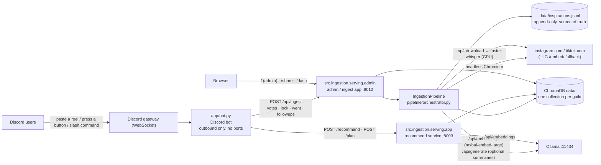
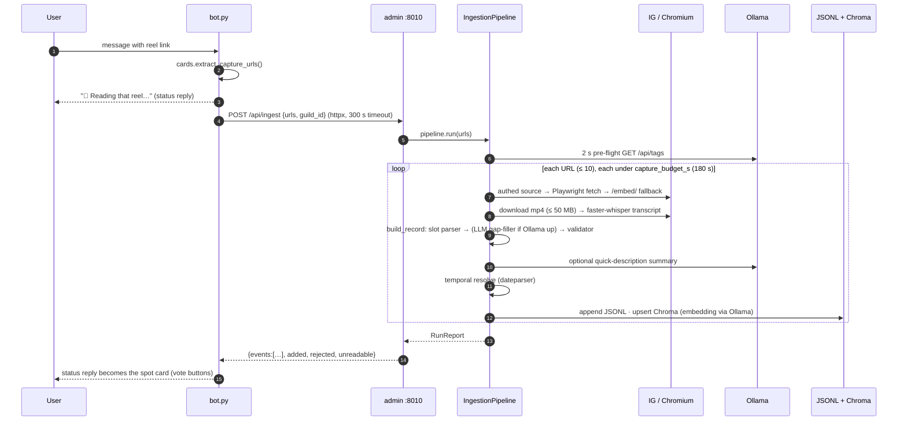
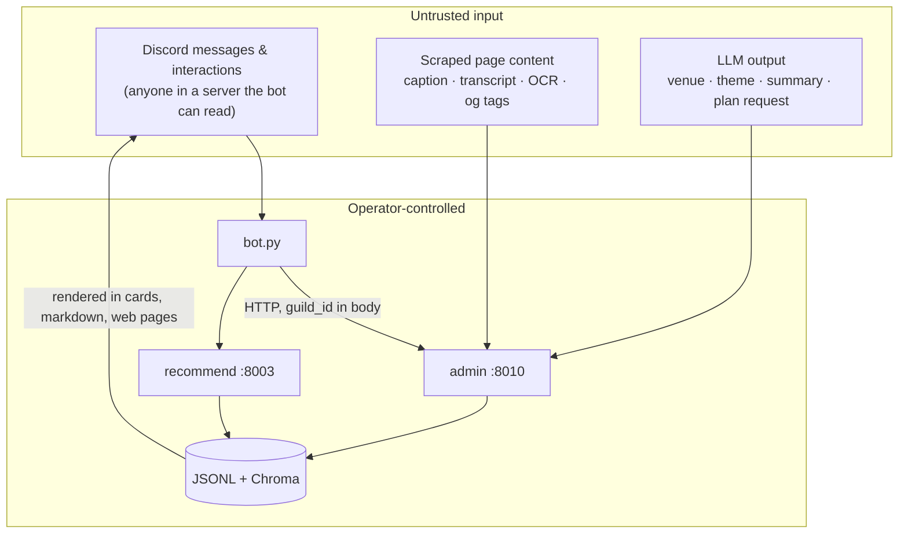

# SpotBot — Architecture

Written 2026-09-15 (Sprint 1 deliverable). Owner: Nick. This is the current-state
topology; decisions behind it live in [`docs/adr/`](adr/README.md). Where an older
doc disagrees with this one (see [§8](#8-older-docs-and-what-they-still-cover)),
this one is right.

Everything runs on one machine with no paid services: local Ollama for embeddings,
OpenStreetMap for geocoding, ChromaDB on disk. Post text never leaves that machine.

---

## 1. Processes and ports

| Process | Entry point | Where it runs | Talks to |
|---|---|---|---|
| **Discord bot** | `python app/bot.py` (or the `discord-bot` container) | host or Docker | Discord gateway (out), admin `:8010`, recommend `:8003` |
| **Admin / ingest app** | `uvicorn src.ingestion.serving.admin:app --port 8010` | **host only** — it drives Playwright and Whisper | Ollama, Chroma, the internet (reels) |
| **Recommend service** | `uvicorn src.ingestion.serving.app:app --port 8003` (or the `recommend` container) | host or Docker | Ollama, Chroma (read) |
| **Ollama** | installed separately | host | — |

`scripts/run_local.ps1` starts the first three on Windows; `docker compose up` starts
only the bot and recommend containers and expects the admin app on the host
(`INGEST_URL=http://host.docker.internal:8010`).

Every service is one uvicorn worker. That is deliberate at this scale and is the
reason capture concurrency is bounded (see [§4](#4-concurrency-and-time-budgets)).

---

## 2. Data

| Store | Path | What it holds | Notes |
|---|---|---|---|
| **JSONL sink** | `data/inspirations.jsonl` | every validated `EventInspiration`, appended per capture | the source of truth; Chroma can be rebuilt from it |
| **ChromaDB** | `data/` (`PersistentClient`, SQLite + HNSW) | vectors + metadata per spot: venue, category, theme, votes, voters, schedule, summary, image | one collection per Discord guild — `chroma_sink.collection_for_guild`; `""` is the legacy single-tenant collection `event_inspirations` |
| **Bot config** | `channels.json` | muted channels, suggestion channels, tipped guilds | written by the bot, not the admin app |
| **Failed-fetch HTML** | `data/raw/snapshot-*.html` | page HTML of rejected / unreadable fetches | debugging only; no retention policy yet |
| **IG session** | `data/ig_session.json` | burner-account cookie for the authed fetch path | gitignored; optional |
| **Label corpus** | `fixtures/labels.jsonl` | 433 labeled reels — the accuracy benchmark | committed; scored by `src/ingestion/eval.py` |

The vectors are bound to the embedding model: the whole store must be written and
queried with the same one (`config.embed_model`, currently `mxbai-embed-large`,
1024-dim). Changing the model means re-embedding from the JSONL. See ADR-0001.

---

## 3. One capture, end to end

Stage → module map:

| Stage | Module | Optional? | Degrades to |
|---|---|---|---|
| Fetch (authed) | `sources/ig_authed.py` (instagrapi) | yes (`IG_USERNAME`) | Playwright |
| Fetch (browser) | `browser/session_manager.py` (Playwright) | required | login wall → `/embed/` fallback (`browser/ig_embed.py`) |
| Extract page → `RawPostSnapshot` | `extractors/instagram.py`, `tiktok.py`, `generic.py` | required | — |
| Transcribe | `pipeline/transcriber.py` (faster-whisper) | yes (`TRANSCRIBE_ENABLED`) | no transcript |
| OCR cover image | `pipeline/ocr.py` (rapidocr) | yes (`OCR_ENABLED`) | no on-screen text |
| Venue / category / city | `pipeline/normalizer.py` (slot parser + alias table + gazetteer) | required | — |
| LLM gap-filler | `pipeline/llm_extractor.py` | yes (Ollama up) | heuristics only — see ADR-0002 |
| Validate | `pipeline/validator.py` → `schemas/inspiration.py` (strict) | required | reject with a reason |
| Summary | `pipeline/summarizer.py` | yes | card shows "No info" |
| Geocode | `pipeline/geo_enricher.py` (Nominatim) | **off in the admin path** | coords from the IG location tag only |
| Schedule | `pipeline/temporal_resolver.py` | yes | `unscheduled` |
| Store | `sinks/jsonl_sink.py`, `sinks/chroma_sink.py` | Chroma best-effort | JSONL always written |

Internals of each stage: [`docs/PIPELINE.md`](PIPELINE.md) §2–3 (still accurate).

---

## 4. Concurrency and time budgets

- `POST /api/ingest` is `async def`; Playwright runs on the event loop, and every
  post-fetch stage runs in `asyncio.to_thread` under `capture_budget_s`
  (default 180 s per URL). Whisper is CPU-bound, so two simultaneous captures
  contend for cores.
- The bot waits synchronously with a **300 s** client timeout
  (`app/bot.py::handle_reel_capture`). A multi-link paste can legitimately exceed
  that while the server keeps working; the bot then reports failure and a Retry
  re-ingests. This is the defect ADR-0004 (async job queue) removes.
- Ollama gets one 2 s pre-flight per run; if it is down the run is
  heuristics-only with no summaries, instantly.
- Per-domain throttling in the session manager; ≤ 10 URLs per request; 50 MB
  cap on any video download.

---

## 5. HTTP contracts (the seams between tracks)

**Bot → admin `:8010`** (`admin.py`)

| Method | Path | Purpose |
|---|---|---|
| POST | `/api/ingest` | `{urls, guild_id}` → `{events, added, rejected, unreadable, log}` |
| GET | `/api/events?guild_id=` | catalog listing for cards, `/catalog`, `/browse`, `/digest` |
| POST | `/api/events/{id}/vote` | `{delta, user_id, user_name}` — identity votes drive quorum |
| POST | `/api/events/{id}/edit` · `/lock` · `/went` | edit modal, Scheduled Event lock-in, went-there confirmations |
| DELETE | `/api/events/{id}` | remove |
| POST | `/api/manual` | manual-add modal |
| GET | `/api/followups?guild_id=&now=` | the hourly went-there loop |
| GET | `/api/stats` · `/api/nights` | dashboard, 100 Nights counter |
| GET | `/` · `/share?guild_id=` · `/dash` | admin page, public read-only catalog, ops dashboard |

**Bot → recommend `:8003`** (`app.py`)

| Method | Path | Purpose |
|---|---|---|
| POST | `/recommend` | `{channel_id, message, mode, guild_id}` → ranked spots + Discord markdown (`/events`, ambient suggestions) |
| POST | `/plan` | `{channel_id, transcript, guild_id, user_id}` → synthesized request + shortlist (`/plan`) |
| GET | `/health` · `/ready` | liveness / store reachable |

`guild_id` selects the Chroma collection on every call, so every call that names one
must carry an **`X-Tenant-Token`** header: an HMAC over the guild (and, for votes and
went-there confirmations, the acting user) signed with `SPOTBOT_SIGNING_KEY`. The bot
mints them with `app/tenant_auth.py::tenant_headers`; the services check them with
`src/ingestion/serving/tenant_auth.py::authorize`. All three processes need the same
key; without it guild calls fail closed with 503. The empty guild `""` (the local admin
page) is exempt. Details: [`THREAT_MODEL.md`](THREAT_MODEL.md) T2.

---

## 6. Trust boundaries

Four crossings matter, each analysed in `THREAT_MODEL.md`: Discord → bot (who can
make it do work), page → pipeline (injection into the extractor and into what the
bot later *says*), LLM → store (grounding), and the `:8010` network edge (tenant
selection, SSRF, exposure).

---

## 7. Module ownership (capstone tracks)

| Area | Paths | Owner |
|---|---|---|
| Capture & sources | `src/ingestion/browser/`, `sources/`, `extractors/`, `pipeline/transcriber.py`, `pipeline/ocr.py` | Track A |
| Accuracy & evaluation | `pipeline/normalizer.py`, `handle_split.py`, `eval.py`, `fixtures/labels.jsonl`, `fixtures/venue_aliases*.json`, `scripts/{review,build_aliases,eval_diagnostics}.py`, `test_extraction_labels.py`, `serving/recommender.py` | Track B |
| Experience | `app/` (bot, cards), web pages in `serving/admin.py`, `docs/USER_GUIDE.md` | Track C |
| Architecture & platform | `pipeline/orchestrator.py`, `serving/admin.py` API, `serving/app.py`, `sinks/`, `config.py`, deployment, CI, ADRs, this doc | Nick |

A change that touches two rows needs both owners on the PR.

---

## 8. Older docs, and what they still cover

| Doc | Still accurate for | Superseded by this doc for |
|---|---|---|
| `docs/PIPELINE.md` | stage internals, the `EventInspiration` contract, degradation table (§1–3) | §4–5 (service ports, `llm`/`db` containers, `llama3.2:1b` embeddings — all gone) |
| `docs/RUNBOOK.md` | rewritten 2026-09-15 to match §1 | — |
| `docs/STACK.md` | library choices | — |
| `README.md` "How it works" | the one-screen version | this doc is the full one |
